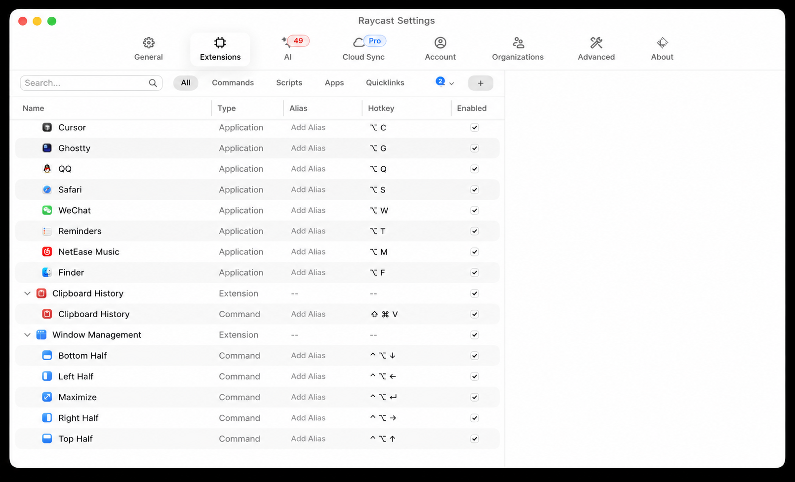
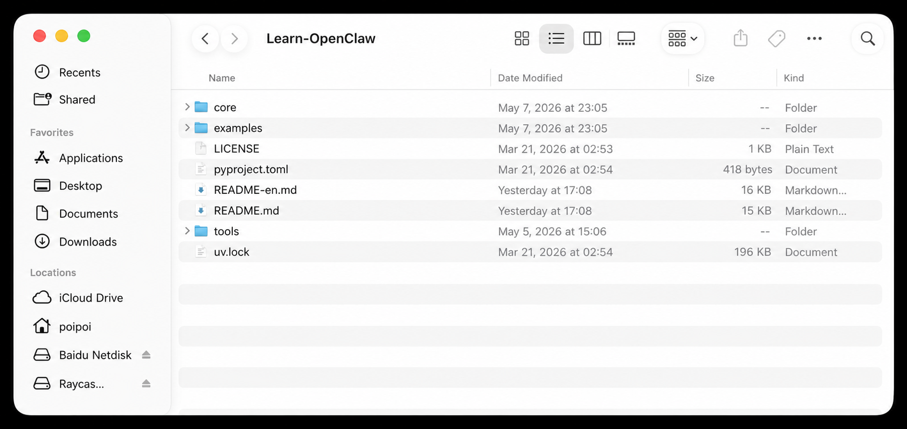
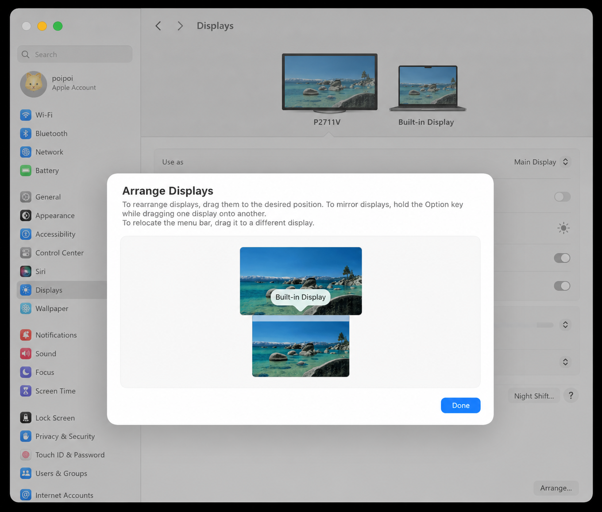

# MacBook Tutorial: Master Your MacBook in One Hour

[中文](./README.md) | [English](./README-en.md)

The goal of this tutorial is simple: help new users learn the core MacBook workflows in about one hour.

Its value is not just teaching you a few more keyboard shortcuts. It helps you avoid many detours in your everyday work and study. Spend one hour getting comfortable with the keyboard, trackpad, screen, and Raycast, and you may save hundreds of hours later. Your MacBook will also feel much smoother and more enjoyable to use.

Do not read this like a manual. Read it while actually trying each step on your own MacBook.

The biggest difference between MacBook and Windows is not the interface. It is the way you operate the computer. A MacBook is not meant to be used by clicking around with a mouse all day. It works best with the keyboard, trackpad, and Raycast.

## 1. Keyboard (about 30 minutes to read and practice)

To use a MacBook well, the first thing to learn is keyboard shortcuts.

MacBook shortcuts mainly come from two places:

- Shortcuts provided or configured through Raycast
- Built-in Apple shortcuts

We will start with Raycast because it is the entry point new users will use most often.

### 1.1 Install Raycast and Open Apps

First, install Raycast.

Open this website and download it: `https://www.raycast.com`

After downloading, drag Raycast into Applications to finish the installation.

After installation, press `Command + Space` to open Spotlight, type `raycast`, and press Enter to open Raycast.

After Raycast opens, follow its onboarding guide and change the launcher shortcut to `Command + Space`.

`Command + Space` is extremely useful.

For example, if you want to open Safari:

1. Press `Command + Space`
2. Type `saf`
3. Raycast will recognize Safari automatically
4. Press Enter to open it

This is the first way to quickly open apps with Raycast.

### 1.2 Set App Shortcuts in Raycast

The second way is to set fixed shortcuts for frequently used apps in Raycast.

Many default shortcuts that use the `Option` key on an Apple keyboard are rarely useful in daily work. For example, with an English input method, you can try these:

| Shortcut | Default input |
| --- | --- |
| `Option + Q` | `œ` |
| `Option + W` | `∑` |
| `Option + E` | Acute accent, such as the accent in `é` |
| `Option + R` | `®` |

Most of these combinations are not very useful, so do not waste them. Use them as shortcuts for apps you open often.

To configure them, press `Command + Space` to open Raycast, then press `Command + ,` to open Raycast settings. Later, we will configure app launching, clipboard history, and window management from this same settings page.

In Raycast settings, open `Shortcuts` and configure `Hotkey` for common features.

You can start by copying the setup in the image below. Cursor, Ghostty, and NetEase Cloud Music are my personal preferences, so new users can skip those. The other shortcuts are recommended.

Recommended shortcuts:

| Feature | Recommended shortcut |
| --- | --- |
| Finder | `Option + F` |
| QQ | `Option + Q` |
| Reminders | `Option + T` |
| Safari | `Option + S` |
| Visual Studio Code | `Option + V` |
| WeChat | `Option + W` |
| Clipboard History | `Command + Shift + V` |
| Switch Windows | `Option + Tab` |
| Raycast Notes | `Option + .` |
| Bottom Half | `Control + Option + Down Arrow` |
| Left Half | `Control + Option + Left Arrow` |
| Maximize | `Control + Option + Enter` |
| Right Half | `Control + Option + Right Arrow` |
| Top Half | `Control + Option + Up Arrow` |

For example, set Safari to `Option + S`.

After setting it:

1. Press `Option + S`
2. Safari opens immediately and appears in front of all windows
3. Press `Option + S` again
4. Safari hides

Press `Option + S` a few more times to feel how it works.

Great. You now know how to open apps quickly.

There are two ways to open apps:

- Press `Command + Space` to open Raycast, then type the app name
- Configure your own shortcut, such as `Option + S` to open Safari directly

### 1.3 Clipboard History

Another very useful feature is clipboard history.

You can set it to `Command + Shift + V`.

After pressing it, you can open your clipboard history and find things you copied earlier.

### 1.4 Window Management

Many people feel that MacBook windows are hard to arrange at first, and may even feel that Windows is more convenient.

But once configured properly, window management on a MacBook is also very convenient.

For example, first open Safari with `Option + S`, then use the Raycast window management shortcut `Control + Option + Left Arrow`.

After pressing it, you will see Safari automatically occupy the left half of the screen.

Press it a few more times and observe how the window size changes. You can also try:

- `Control + Option + Left Arrow`
- `Control + Option + Right Arrow`
- `Control + Option + Up Arrow`
- `Control + Option + Down Arrow`
- `Control + Option + Enter`

`Control + Option + Enter` maximizes the current window.

After trying these, you will find that managing windows is actually easy.

### 1.5 Built-in Apple Shortcuts

After Raycast, remember a few built-in Apple shortcuts.

One of the best built-in shortcuts is Quick Look in Finder: press `Space` to preview a file.

Open Finder, select an image, PPT, PDF, MP3, txt file, or a song, then press Space.

You will see a preview open instantly, and it is very fast. You do not need to open the actual app. This experience is far better than Windows and is one of the things that makes MacBook so pleasant to use.

Also remember this Finder habit:

**Use list view in Finder, not icon view.**

List view works better with keyboard navigation and makes it easier to find files quickly.

How to switch:

- Click the list view button at the top of Finder
- Or press `Command + 2`

Beginners only need to remember these at first:

| Shortcut | Action |
| --- | --- |
| `Command + Q` | Quit an app |
| `Command + W` | Close a window or tab |
| `Command + C` | Copy |
| `Command + V` | Paste |

Other shortcuts, such as `Command + T` and `Command + ,`, will become familiar naturally as you use them more.

Remember: if you want to use a MacBook well, shortcuts are essential, and you will use them constantly.

## 2. Trackpad (about 10 minutes to read and practice)

After shortcuts, let us talk about the trackpad.

First, remember this:

**MacBook is designed for the trackpad, not for the mouse.**

So if you want to use a MacBook well, put the mouse away.

The trackpad is not complicated. Beginners only need to learn three types of gestures.

Here is what you need to learn:

| Fingers | Actions to learn |
| --- | --- |
| One finger | Select text |
| Two fingers | Right-click, scroll, zoom in and out |
| Three fingers | View all windows, switch desktops |

Now let us practice through tasks.

### 2.1 One Finger

First, open your browser with `Option + S`, then open `https://github.com/lasywolf/Learn-OpenClaw/blob/main/README-en.md`.

Now practice one-finger operation.

After the page opens, find the heading near the beginning that says "What Can This Tutorial Do for You?"

Then:

1. Place the cursor at the beginning of that sentence
2. Press and hold the trackpad with your middle finger
3. Drag downward
4. Keep dragging until you reach a later part of the article

Congratulations. You have completed the one-finger operation.

### 2.2 Two Fingers

Two-finger gestures have three common uses:

- Right-click
- Scroll pages
- Zoom in and out

#### Right-click

You just selected a piece of text with one finger.

Next, use a two-finger gesture to copy it.

Steps:

1. Tap the trackpad with your middle finger and ring finger together
2. A right-click menu will appear
3. Click "Copy" with your middle finger

Congratulations. You have learned the first two-finger function: using it as right-click.

#### Scroll Pages

Now learn the second two-finger function: scrolling.

Steps:

1. Put your middle finger and ring finger on the trackpad without pressing down
2. Slide both fingers up and down together
3. Watch the webpage scroll with your fingers

This gesture is used constantly. You will use it when reading webpages and documents.

#### Zoom In and Out

Two fingers can also zoom in and out.

This works exactly like viewing photos on a phone.

The gesture is natural:

- Spread your index finger and middle finger apart to zoom in
- Pinch your index finger and middle finger together to zoom out

This is very useful when viewing images, webpages, or maps.

### 2.3 Three Fingers

Three-finger gestures have two common uses:

- View all windows
- Switch desktops

#### View All Windows

The most important three-finger gesture is Mission Control, which shows all windows.

Steps:

1. Place three fingers on the trackpad at the same time
2. Swipe up
3. You will see all windows shrink and appear together
4. Swipe down with three fingers to return to the original screen

This helps you quickly find open windows.

#### Switch Desktops

Next, see what happens when you swipe left and right with three fingers.

First, open Safari with `Option + S`, then open this video: `https://www.youtube.com/watch?v=dQw4w9WgXcQ&list=RDdQw4w9WgXcQ&start_radio=1`

Click full screen after opening it.

You will see that the video fills the entire screen.

Then:

1. Swipe up with three fingers
2. You will see two desktops at the top
3. The first is your original desktop
4. The second is the full-screen desktop for the video

Click the first desktop to return to your original desktop.

Now try:

- Swipe left with three fingers to enter the video desktop
- Swipe right with three fingers to return to the original desktop

Once you learn this, you will understand how multiple desktops work on a MacBook.

## 3. Screen (about 10 minutes to read and practice)

Many new users feel that the MacBook screen is small. Usually, the screen is not really the problem. The windows are just not arranged well.

Some users also feel that the trackpad becomes hard to use after connecting an external monitor.

This is usually not a trackpad problem. It means the workflow is still based on mouse habits. Especially with multiple displays, you should not always use the mouse to find apps in the Dock, drag windows around, or look for apps from the menu bar at the top. A better approach is to rely more on keyboard shortcuts and Raycast to control apps and windows.

Use Raycast to manage windows.

First learn how to:

- Move a window to the left half of the screen
- Move a window to the right half of the screen
- Switch quickly between multiple windows
- Move a window from one screen to another

The most common working layout is:

**Research on the left, writing on the right.**

### 3.1 Hide the Dock

It is recommended to hide the Dock at the bottom of your MacBook.

This gives you more screen space and makes the computer more comfortable to use.

Steps:

1. Press `Command + Space` to open Raycast
2. Type `xitongshezhi` to open System Settings
3. Search for "show dock" in System Settings
4. Enable "Automatically hide and show the Dock"

After this, the Dock at the bottom will hide automatically. When you need it, move the cursor to the bottom of the screen and it will appear.

### 3.2 External Display Arrangement

If you use an external monitor, prioritize a 4K display. A MacBook connected to a 4K display usually looks clearer than one connected to a 2K display.

The reason is that a 4K display can combine 4 physical pixels into 1 display pixel, making text and the interface look more refined. A 2K display usually cannot provide the same comfortable display quality.

After connecting an external display, remember to adjust the display arrangement in System Settings so the layout in macOS matches your real desk.

Steps:

1. Press `Command + Space` to open Raycast
2. Type `xitongshezhi` to open System Settings
3. Search for "arrangement" in System Settings
4. Find and click "Arrange..."
5. Drag the external display and built-in display to the correct positions

### 3.3 Manage Windows with Shortcuts

After connecting an external display, do these three things first:

1. Arrange the displays in System Settings to match your actual desk
2. Learn how to move an app window from one screen to another
3. Use Raycast window management shortcuts to split the screen

Challenge: use shortcuts to complete a multi-window setup.

Assume you have configured these shortcuts:

- `Option + S`: open Safari
- `Option + W`: open WeChat
- `Control + Option + Left Arrow`: move the window to the left half
- `Control + Option + Right Arrow`: move the window to the right half

Now complete these steps:

1. On the MacBook screen, press `Option + S` to open Safari
2. Press `Control + Option + Right Arrow` to move Safari to the right half
3. Press `Option + W` to open WeChat
4. Press `Control + Option + Left Arrow` to move WeChat to the left half

Now the screen is divided into a left half and a right half.

At this point, you will see that multiple displays are not hard to use. You just need to manage windows with shortcuts.

## 4. Tips (about 10 minutes to read and practice)

Congratulations. The content above is enough to cover 90% of daily operations.

You have learned the most important MacBook workflows.

For the remaining 10%, such as "How do I do xxx on a MacBook?", do not click around randomly for too long. Ask AI directly.

You can ask:

- How do I truly quit an app on a MacBook?
- How do I configure the MacBook trackpad?
- How do I manage windows with Raycast?
- How do I open folders with the keyboard in Finder?
- How do I set up an external monitor on a MacBook?

This is the AI era. The fastest way to learn computer operations is to ask while using.

### Recommended Software

You can install these first:

- Cursor
- Visual Studio Code
- Ghostty
- fish
- Homebrew
- Chrome
- WeChat
- QQ
- Tencent Meeting
- Keka
- NetEase Cloud Music
- Steam
- Wuthering Waves

## Final Tasks

Now go through everything you learned above from start to finish.

### Task 1: Open Apps

1. Press `Command + Space` to open Raycast
2. Type `saf` to open Safari
3. Press `Option + S` again and observe Safari hiding
4. Press `Option + S` again and observe Safari returning to the front

### Task 2: Practice Finder

1. Press `Command + Space` to open Raycast
2. Type Finder and open it
3. Press `Command + 2` to switch Finder to list view
4. Select an image, PPT, PDF, MP3, or txt file
5. Press Space to preview the file
6. Press Space again to close the preview

### Task 3: Practice the Trackpad

1. Open Safari with `Option + S`
2. Open `https://github.com/lasywolf/Learn-OpenClaw/blob/main/README-en.md`
3. Use one finger to drag and select a piece of text
4. Tap with two fingers to open the right-click menu
5. Click "Copy" with your middle finger
6. Scroll the webpage up and down with two fingers
7. Zoom in and out on the page with two fingers, just like viewing photos on a phone

### Task 4: Practice Three Fingers and Desktops

1. Open Safari with `Option + S`
2. Open `https://www.youtube.com/watch?v=dQw4w9WgXcQ&list=RDdQw4w9WgXcQ&start_radio=1`
3. Click full-screen playback
4. Swipe up with three fingers to view all windows and desktops
5. Swipe down with three fingers to return to the original screen
6. Swipe left and right with three fingers to switch between the video desktop and your original desktop

### Task 5: Practice Window Management

1. Open Safari with `Option + S`
2. Press `Control + Option + Enter` to maximize Safari
3. Press `Control + Option + Right Arrow` to move Safari to the right half
4. Open WeChat with `Option + W`
5. Press `Control + Option + Left Arrow` to move WeChat to the left half

### Optional Task: Organize Screen Space

If you want to make the screen more comfortable to use, complete these two settings:

1. Press `Command + Space` to open Raycast
2. Type `xitongshezhi` to open System Settings
3. Search for "show dock"
4. Enable "Automatically hide and show the Dock"
5. If you have an external display, search for "arrangement"
6. Click "Arrange..." in the lower-right corner
7. Drag the external display and built-in display to match your real desk

If you can complete all these tasks, congratulations. You have fully learned the core MacBook workflows.

From now on, your MacBook will save you a huge amount of time in daily life, work, and study.
