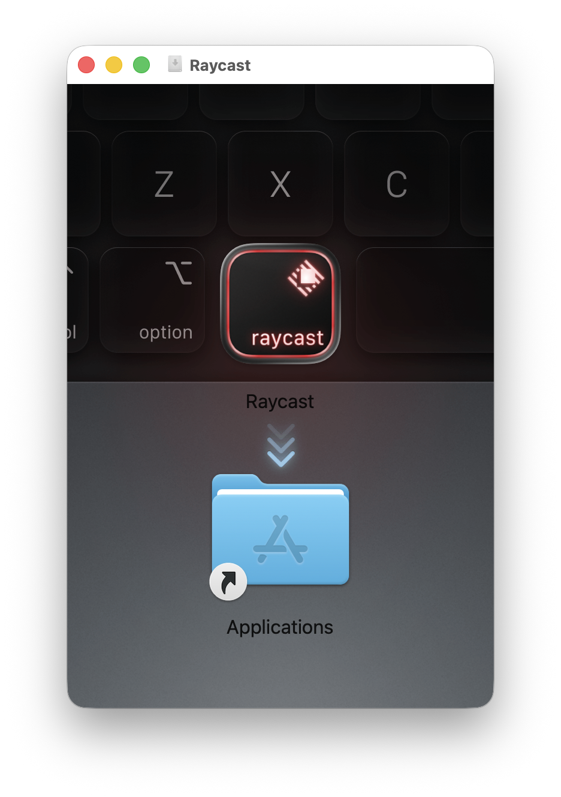
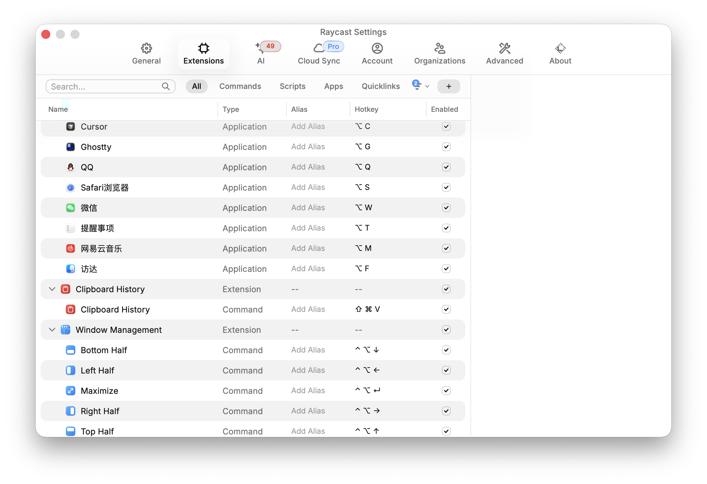
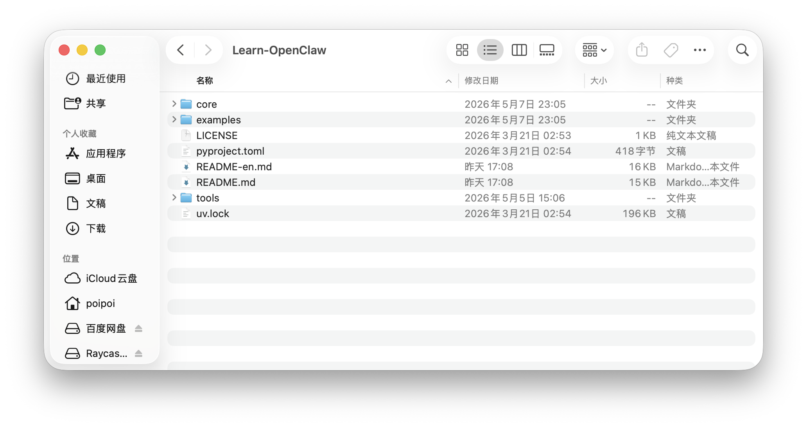

# MacBook Tutorial 一小时掌握 MACBOOK

这个教程的目标很简单：让新同学用一小时掌握 MacBook 的核心用法。

它的价值不是让你多知道几个快捷键，而是让你在后面的日常工作和学习中少走很多弯路。花一小时把键盘、触控板、屏幕和 Raycast 用顺，后面可能会节省上百倍的时间，而且 MacBook 用起来也会更舒服、更愉悦。

不要把它当成说明书看。请一边看，一边真的在自己的 MacBook 上做一遍。

MacBook 和 Windows 最大的区别，不是界面不一样，而是操作习惯不一样。MacBook 不适合一直靠鼠标点来点去，它更适合用键盘、触控板和 Raycast。

## 1. 键盘（阅读和练习需约 30 分钟）

想用好 MacBook，第一件事是学会快捷键。

MacBook 的快捷键主要有两个来源：

- Raycast 提供的快捷键和自己配置的快捷键
- 苹果官方自带的快捷键

我们先讲 Raycast，因为它是新同学最常用的入口。

### 1.1 安装 Raycast 并打开应用

第一件事：先给电脑装上 Raycast。

打开这个网址下载安装：`https://www.raycast.com`

下载后，把 Raycast 拖到 Applications 里完成安装。

安装 Raycast 后，第一件事是把 Raycast 的入口快捷键设置成 `Command + 空格`。

`Command + 空格` 非常常用。

比如你想打开 Safari：

1. 按 `Command + 空格`
2. 输入 `saf`
3. Raycast 会自动识别到 Safari
4. 按回车打开

这就是用 Raycast 快速打开应用的第一种方式。

### 1.2 用 Raycast 给应用设置快捷键

第二种方式，是在 Raycast 里给常用应用设置固定快捷键。

苹果键盘上的 `Option` 键，很多默认快捷键我们平时几乎用不到。比如在英文输入法下，你可以试一下：

| 快捷键          | 默认输入             |
| ------------ | ---------------- |
| `Option + Q` | `œ`              |
| `Option + W` | `∑`              |
| `Option + E` | 急音符号，例如 `é` 里的重音 |
| `Option + R` | `®`              |

这些组合大多数时候没什么用，所以不要浪费，可以拿来给常用应用做快捷键。

配置方法是：先按 `Command + 空格` 打开 Raycast，然后按 `Command + ,` 进入 Raycast 设置页面。后面我们打开应用、剪贴板历史、窗口管理，都会在这里配置。

进入 Raycast 设置后，打开 `Shortcuts`，给常用功能配置 `Hotkey`（快捷键）。

可以先照着下面这张图配置。图里 Cursor、Ghostty、网易云音乐这几个是我自己的使用习惯，新同学可以先不用配置，其他快捷键建议照着配。

推荐先配置这些：

| 功能 | 推荐快捷键 |
| --- | --- |
| Finder | `Option + F` |
| QQ | `Option + Q` |
| Reminders | `Option + T` |
| Safari | `Option + S` |
| Visual Studio Code | `Option + V` |
| WeChat | `Option + W` |
| Clipboard History | `Command + Shift + V` |
| Switch Windows | `Option + Tab` |
| Raycast Notes | `Option + .` |
| Bottom Half | `Control + Option + 下方向键` |
| Left Half | `Control + Option + 左方向键` |
| Maximize | `Control + Option + Enter` |
| Right Half | `Control + Option + 右方向键` |
| Top Half | `Control + Option + 上方向键` |

比如给 Safari 设置 `Option + S`。

设置好之后：

1. 按 `Option + S`
2. Safari 会立刻打开，并出现在所有窗口最前面
3. 再按一次 `Option + S`
4. Safari 会隐藏

你可以多按几次 `Option + S`，感受一下这个效果。

太棒了，你现在已经懂得怎么快速打开应用了。

打开应用一共有两种方式：

- `Command + 空格` 打开 Raycast，输入应用名打开
- 自己配置快捷键，比如 `Option + S` 直接打开 Safari

### 1.3 剪贴板历史

还有一个非常常用的功能：剪贴板历史。

可以设置为 `Command + Shift + V`。

按下之后，就可以打开剪贴板历史，找到之前复制过的内容。

### 1.4 窗口管理

很多人刚开始会觉得 MacBook 的窗口不好排列，甚至觉得 Windows 更方便。

其实配置好之后，MacBook 的窗口管理也非常方便。

例如我们先用 `Option + S` 打开 Safari，然后用 Raycast 配置窗口管理快捷键 `Control + Option + 左方向键`。

按下之后，你会发现 Safari 自动占据屏幕左半边。

你可以多按几次，观察窗口比例的变化。也可以试试：

- `Control + Option + 左方向键`
- `Control + Option + 右方向键`
- `Control + Option + 上方向键`
- `Control + Option + 下方向键`
- `Control + Option + Enter`

其中 `Control + Option + Enter` 是把当前窗口自动放大到全屏。

试完你会发现，管理窗口其实非常轻松。

### 1.5 苹果官方快捷键

Raycast 讲完之后，再记几个苹果官方快捷键。

苹果官方快捷键里，最好用、也最出色的一点，是 Finder 里的 `空格` 预览。

打开 Finder，选中一张图片、一个 PPT、一个 PDF、一个 MP3、一个 txt，或者一首歌，然后按一下空格。

你会发现它会立刻打开预览，而且速度非常快，不需要真正打开应用。这个体验远超 Windows，也是 MacBook 非常好用的一个点。

这里顺便记住一个 Finder 使用习惯：

**Finder 应该用列表视图，不要用图标视图。**

列表视图更适合用键盘上下移动，也更适合快速找文件。

切换方法：

- 点击 Finder 顶部的列表视图按钮
- 或者按 `Command + 2`

新手最开始只需要记住这几个：

| 快捷键           | 作用       |
| ------------- | -------- |
| `Command + Q` | 退出应用     |
| `Command + W` | 关闭窗口或标签页 |
| `Command + C` | 复制       |
| `Command + V` | 粘贴       |

其他快捷键，比如 `Command + T`、`Command + ,`，后续用多了自然会慢慢学会。

记住：如果你想用好 MacBook，快捷键是必须掌握的，而且会非常高频地用到。

## 2. 触控板（阅读和练习需约 10 分钟）

讲完快捷键，我们接下来讲触控板。

首先要记住一点：

**MacBook 是专门为触控板设计的，不是为鼠标设计的。**

所以想用好 MacBook，一定要把鼠标丢掉。

触控板其实没有那么复杂。新手只需要学会三类操作。

先看一下你要学什么：

| 手指  | 要学的操作       |
| --- | ----------- |
| 单指  | 选择文字        |
| 双指  | 右键、滚动、放大缩小  |
| 三指  | 查看所有窗口、切换桌面 |

下面我们直接通过任务来练习。

### 2.1 单指

先用 `Option + S` 打开浏览器，然后打开 `https://github.com/lasywolf/Learn-OpenClaw`。

我们现在开始练习单指操作。

打开网页后，找到文章开头的“这个 tutorial 能干什么”。

然后：

1. 把光标放在这句话的最前面
2. 用中指按住触控板
3. 往下拖动
4. 一直拖到文章后面

恭喜你，你已经完成了单指操作。

### 2.2 双指

双指一共有三个常用操作：

- 右键
- 滚动页面
- 放大缩小

#### 右键

刚才我们已经用单指选中了一段内容。

接下来用双指操作，把内容复制出来。

做法：

1. 用中指和无名指一起点按触控板
2. 这时会出现右键菜单
3. 用中指点击“拷贝”

恭喜你，你学会了双指的第一个功能：当作右键使用。

#### 滚动页面

接下来学习双指的第二个功能：滑动浏览。

做法：

1. 把中指和无名指放在触控板上（不要按下去）
2. 两根手指一起上下滑动
3. 观察网页跟着你的手指滚动

这个动作非常常用。以后看网页、看文档，基本都会用到。

#### 放大和缩小

双指还可以用来放大和缩小。

这个操作和你在手机上看图片时一模一样。

做法很自然：

- 食指和中指往外张开：放大
- 食指和中指往里收拢：缩小

看图片、网页或地图时，这个操作非常好用。

### 2.3 三指

三指一共有两个常用操作：

- 查看所有窗口
- 切换桌面

#### 查看所有窗口

三指最重要的操作，是进入窗口总览。

做法：

1. 三根手指同时放在触控板上
2. 往上滑
3. 你会看到所有窗口都缩小展示出来
4. 三根手指往下滑，回到原来的界面

这个功能可以帮你快速找到当前打开的窗口。

#### 切换桌面

接下来看看三指左右滑动有什么效果。

先用 `Option + S` 打开 Safari，然后打开这个视频：`https://www.bilibili.com/video/BV1GJ411x7h7`

打开后点击全屏。

这时你会发现，整个屏幕都被视频占满了。

然后：

1. 三根手指往上滑
2. 你会看到上面有两个桌面
3. 第一个是原来的桌面
4. 第二个是专门放视频的全屏桌面

点击第一个桌面，就会回到原来的桌面。

接下来试试：

- 三根手指往左滑：进入视频桌面
- 三根手指往右滑：回到原来的桌面

学会这个之后，你就知道 MacBook 的多桌面是怎么用的了。

## 3. 屏幕（阅读和练习需约 10 分钟）

很多新同学觉得 MacBook 屏幕小，其实通常不是屏幕小，而是窗口没有摆好。

也有同学会觉得：外接屏幕后，触控板好像很难用。

这通常不是触控板的问题，而是使用方式还停留在鼠标习惯里。尤其是多屏幕时，不应该总是用鼠标去底部 Dock 里找应用、拖窗口，或者从最上面的状态栏里找应用。更好的方式是积极多用键盘快捷键和 Raycast 来控制应用和窗口。

建议用 Raycast 管理窗口。

先学会：

- 把窗口放到左半屏
- 把窗口放到右半屏
- 在多个窗口之间快速切换
- 把窗口从一个屏幕移动到另一个屏幕

最常见的工作方式是：

**左边查资料，右边写东西。**

### 3.1 隐藏底部程序坞

MacBook 最底下的程序坞建议隐藏掉。

这样会有更大的屏幕空间，使用起来更舒适。

操作方法：

1. 按 `Command + 空格` 打开 Raycast
2. 输入 `xitongshezhi`，打开系统设置
3. 在系统设置的搜索框里搜索“显示程序坞”
4. 勾选“自动隐藏和显示程序坞”

设置完之后，底部程序坞会自动隐藏。需要用的时候，把光标移动到屏幕底部，它就会出现。

### 3.2 外接屏幕排列

如果要外接屏幕，优先选择 4K 屏幕。MacBook 接 4K 屏幕通常会比 2K 屏幕更清楚。

原因是 4K 屏幕可以把 4 个像素点合成为 1 个显示像素，这样文字和界面看起来会更细腻。2K 屏幕通常做不到这么舒服的显示效果。

外接屏幕后，记得去系统设置里调整屏幕摆放，让系统里的屏幕位置和真实桌面一致。

操作方法：

1. 按 `Command + 空格` 打开 Raycast
2. 输入 `xitongshezhi`，打开系统设置
3. 在系统设置的搜索框里搜索“排列”
4. 找到并点击右下角的“排列...”
5. 把外接显示器和内建显示器拖到正确的位置

### 3.3 用快捷键管理窗口

外接屏幕后，先做三件事：

1. 在系统设置里把屏幕排列成和真实桌面一样的位置
2. 学会把一个应用窗口从一个屏幕移动到另一个屏幕
3. 用 Raycast 的窗口管理快捷键来分屏

挑战：用快捷键完成一次多屏分工。

假设你已经配置好了这些快捷键：

- `Option + S`：打开 Safari
- `Option + W`：打开 WeChat
- `Control + Option + 左方向键`：窗口放到左半屏
- `Control + Option + 右方向键`：窗口放到右半屏

现在完成下面动作：

1. 在笔记本屏幕上按 `Option + S` 打开 Safari
2. 按 `Control + Option + 右方向键`，把 Safari 放到右半屏
3. 按 `Option + W` 打开 WeChat
4. 按 `Control + Option + 左方向键`，把 WeChat 放到左半屏

这样屏幕就被分成了左半边和右半边。

这时你就会发现，多屏幕并不是难用，而是要用快捷键来管理窗口。

## 4. 小贴士（阅读和练习需约 10 分钟）

恭喜你，上面的内容已经足够覆盖 90% 的日常操作了。

你已经学会 MacBook 最重要的使用方式了！

剩下的 10%，比如“MacBook 怎么 xxx”，不要自己乱点太久，直接问 AI 怎么操作。

可以这样问：

- MacBook 怎么真正退出应用？
- MacBook 怎么设置触控板？
- Raycast 怎么管理窗口？
- Finder 怎么用键盘打开文件夹？
- MacBook 外接屏幕怎么设置？

现在是 AI 时代，学电脑操作最快的方法就是边用边问。

### 推荐软件清单

可以先安装这些：

- Cursor
- Visual Studio Code
- Ghostty
- fish
- Homebrew
- Chrome
- WeChat
- QQ
- Tencent Meeting
- Keka
- NeteaseMusic
- Steam
- 鸣潮

## 最后任务

现在把前面学过的内容完整做一遍。

### 任务 1：打开应用

1. 用 `Command + 空格` 打开 Raycast
2. 输入 `saf`，打开 Safari
3. 再按一次 `Option + S`，观察 Safari 隐藏
4. 再按一次 `Option + S`，观察 Safari 回到最前面

### 任务 2：练习 Finder

1. 用 `Command + 空格` 打开 Raycast
2. 输入 Finder 并打开
3. 按 `Command + 2`，把 Finder 切换成列表视图
4. 选中一张图片、一个 PPT、一个 PDF、一个 MP3 或一个 txt
5. 按空格预览文件
6. 再按一次空格关闭预览

### 任务 3：练习触控板

1. 用 `Option + S` 打开 Safari
2. 打开 `https://github.com/lasywolf/Learn-OpenClaw`
3. 用单指拖动，选中一段文字
4. 用双指点按，打开右键菜单
5. 用中指点击“拷贝”
6. 用双指上下滑动网页
7. 像手机看图片一样，用双指放大和缩小页面

### 任务 4：练习三指和桌面

1. 用 `Option + S` 打开 Safari
2. 打开 `https://www.bilibili.com/video/BV1GJ411x7h7`
3. 点击全屏播放
4. 三指上滑，查看所有窗口和桌面
5. 三指下滑，回到原来的界面
6. 三指左右滑动，在视频桌面和原来的桌面之间切换

### 任务 5：练习窗口管理

1. 用 `Option + S` 打开 Safari
2. 按 `Control + Option + Enter`，让 Safari 自动全屏
3. 按 `Control + Option + 右方向键`，把 Safari 放到右半屏
4. 按 `Option + W` 打开 WeChat
5. 按 `Control + Option + 左方向键`，把 WeChat 放到左半屏

### 可选任务：整理屏幕空间

如果你想把屏幕用得更舒服，再做下面两个设置：

1. 用 `Command + 空格` 打开 Raycast
2. 输入 `xitongshezhi`，打开系统设置
3. 搜索“显示程序坞”
4. 勾选“自动隐藏和显示程序坞”
5. 如果你有外接屏幕，再搜索“排列”
6. 点击右下角的“排列...”
7. 把外接显示器和内建显示器拖到和真实桌面一样的位置

如果你能完整做完这些任务，恭喜你，你已经完全掌握 MacBook 了。

后面它会在你的日常生活、工作和学习中，为你节省上百倍的时间。
